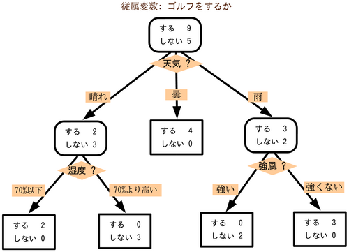

1. ナイーブベイズ（Naive Bayes）： 
    
    テキスト分類や感情分析などのタスクに使用されます。特に、スパムメールフィルタリングなどのテキスト分類問題に広く応用されています。
    
    1.1 利点
    
        単純さと効率性： ナイーブベイズは計算が単純であり、大量のデータセットに対しても高速に学習と予測が可能です。
        
        理解しやすさ： モデルの背後にある原理が比較的簡単であるため、解釈しやすいです。
        
        少量のデータでも有効： パラメータの数が少ないため、比較的少量のデータからでも有効なモデルを構築できます。
        
        多クラス分類に適している： ナイーブベイズは自然に多クラス分類問題に適用できます。
        
        柔軟性： テキスト分類だけでなく、感情分析やスパム検出など、さまざまな種類のデータセットに適用できる柔軟性があります。
    
    1.2 欠点

        特徴間の独立性の仮定： ナイーブベイズは特徴間が互いに独立であるという強い仮定を置きます。実際のデータセットではこの仮定が成り立たないことが多く、モデルの性能に影響を与えることがあります。
        
        特徴の重要性を等しく扱う： すべての特徴が結果に等しく寄与すると扱うため、実際には重要性が異なる特徴があっても、その差を考慮できません。
        
        予測確率の信頼性： ナイーブベイズはクラスの事前確率を利用するため、事前確率の推定が不正確だと予測の信頼性が低下します。
        
        複雑な関係のモデリングが困難： 線形関係や単純なパターンの識別には有効ですが、入力特徴間に複雑な関係がある場合、モデルの表現力が不足することがあります。

    1.3 訓練

        データの準備： 訓練データセットを準備します。このデータセットは、特徴量とそれに対応するラベル（クラス）から成り立っています。

        特徴量の選択： モデルの訓練に使用する特徴量を選択します。ナイーブベイズは特にテキストデータで強力であり、単語の出現回数や出現頻度など、テキストから抽出した特徴がよく使用されます。

        クラスの事前確率の計算： 訓練データセット内の各クラスの事前確率を計算します。これは、特定のクラスに属するサンプル数を、全サンプル数で割ることで求められます。

        条件付き確率の計算： 各クラスにおける特徴量の条件付き確率を計算します。これは、特定の特徴量が与えられた場合に、各クラスに属する確率を意味します。例えば、テキスト分類では、特定の単語が文書に現れる確率を各クラスで計算します。

        スムージング： ゼロ確率問題を避けるためにスムージング（例：ラプラススムージング）を適用します。これにより、訓練データに一度も現れない特徴量がテストセットに現れた場合でも、モデルがゼロ確率を割り当てることなく確率を計算できるようになります。

        モデルの訓練： 上記の計算を用いて、ナイーブベイズモデルを訓練します。これにより、未知のデータに対してクラスの予測を行うための条件付き確率が得られます。

        予測： 訓練されたモデルを使用して、新しいデータポイントのクラスを予測します。各クラスの事前確率と、与えられたデータポイントの特徴量に基づく条件付き確率を掛け合わせ、最も確率が高いクラスを選択します。

    1.4　有効とされるタスク(sklearn)

        テキスト分類、スパム検出、推薦システム、感情分析
    
2. サポートベクターマシン　

    テキスト分類、固有表現認識などのタスクで優れた性能を発揮します。異なるタイプのデータに適応するために、さまざまなカーネル関数を使用することができます。

    2.1　SVMについて

        線形分離: SVMは、異なるクラスのデータポイントを最もよく分離する特徴空間内の超平面を見つけることを目指します。二次元空間では、この超平面は線であり、三次元空間では平面であり、さらに高次元の空間では超平面と呼ばれます。

        マージンの最大化: マージンは、超平面と各クラスから最も近いデータポイントとの距離であり、SVMはこのマージンを最大化しようとします。マージンが大きいほど、モデルの一般化性能は向上します。

        サポートベクター: サポートベクターは、決定境界（超平面）に最も近いデータポイントです。これらのベクターは、超平面の位置と向きを決定する上で重要な役割を果たします。SVMは訓練プロセスにおいて、これらのサポートベクターに注目します。

        ソフトマージン（Cパラメーター）: データが完全に分離可能でない場合、SVMはいくつかのデータポイントがマージンの間違った側にある、または超平面の間違った側にあることを許容することによって、ソフトマージンを導入します。Cパラメーターは、滑らかな決定境界を持つことと、訓練ポイントを正しく分類することとの間のトレードオフを制御します。

        カーネルトリック: SVMは、カーネル関数を使用して入力特徴を高次元空間にマッピングすることにより、非線形分離可能なデータを効率的に扱うことができます。これにより、SVMは変換された空間内でクラスを分離する超平面を見つけることができます。

        カーネル関数: 一般的なカーネル関数には、線形、多項式、放射基底関数（RBFまたはガウス）、シグモイドが含まれます。カーネルの選択は、データの性質と手がかりとなる問題に依存します。
    
    2.2 カーネル関数

    2.2.1 線形カーネル関数（Linear Kernel）:
        
        適用シナリオ： データが線形分離可能な場合、または特徴の次元が非常に高い場合、線形カーネル関数は良い選択です。
        
        特徴： 計算速度が速く、大規模なデータセットに適しています。
        
    2.2.2 多項式カーネル関数（Polynomial Kernel）:

        適用シナリオ： データが線形分離不可能な場合、多項式カーネル関数を使用して高次の特徴を導入し、モデルの複雑さを高めることができます。
        
        特徴： 調整が必要なパラメータには、多項式の次数（degree）と定数項（coef0）が含まれます。
        
    2.2.3 径向基関数カーネル（Radial Basis Function, RBF）:

        適用シナリオ： ほとんどの場合、RBFカーネルはSVMで最も一般的に使用されるカーネル関数であり、特にデータの性質が不明な場合に適しています。
        
        特徴： RBFカーネルはガウス関数を導入し、複雑な非線形決定境界に適しています。調整が必要なパラメータには、ガウスカーネルの幅パラメータ（gamma）が含まれます。
    
    2.2.4 Sigmoidカーネル関数:

        適用シナリオ： Sigmoidカーネルは、神経網などの非線形分離可能な問題に主に使用されます。
        特徴： 調整が必要なパラメータには、Sigmoidカーネルのパラメータ
        
    カーネル関数の選択プロセスは通常、交差検証（cross-validation）による性能評価に基づいています。複数のカーネル関数とそのパラメータの組み合わせを試し、交差検証を通じて最も良い効果を持つモデルを選択します。実践では、グリッドサーチ（grid search）やランダムサーチ（random search）などの方法を使用して、最適なパラメータの組み合わせを見つけるために超パラメータを調整します。

    2.4 訓練のステップ

        データの準備: 訓練データセットを準備します。データは特徴量のセットとそれに対応するクラスラベルから構成されます。

        データの前処理: データを適切な形式に前処理します。これには、特徴量のスケーリングや正規化、欠損値の処理、カテゴリカルデータのエンコーディングなどが含まれます。

        モデルの選択: SVMモデルを選択し、カーネル関数（線形、多項式、RBFなど）とハイパーパラメータ（C、gammaなど）を選択します。

        モデルの学習: 選択したSVMモデルを訓練データに適合させます。これにより、決定境界がデータを最もよく分割するように学習されます。

        モデルの評価: 訓練されたモデルをテストデータセットに適用し、性能を評価します。一般的な評価指標には、精度、再現率、適合率、F1スコアなどがあります。

        ハイパーパラメータのチューニング: 必要に応じて、モデルのハイパーパラメータを調整して、性能を最適化します。これには、クロスバリデーションなどの手法が使用されます。

        最終モデルの適合: 最適なハイパーパラメータを見つけたら、訓練データ全体を使用して最終的なモデルを適合させます。

        モデルの利用: 最終的な訓練されたモデルを使用して、新しいデータのクラスを予測します。

    2.5 応用

        テキスト分類、感情分析、NER、トピック識別

3. decision tree　決定木

    3.1 決定木について

    

    基本的な概念
    決定木は、ルートノード（最初の質問）、内部ノード（中間質問）、リーフノード（結論または予測値）から構成されます。各ノードは、データに対する特定の質問や条件に対応し、データセットをより均一なサブセットに分割していきます。

    3.2 利点と欠点
    
    利点
        
        直感的で理解しやすい：生成されたモデルは、条件分岐の連続として表現されるため、非専門家にも理解しやすいです。
        データの前処理が少ない：正規化や標準化などの前処理が必須ではありません。
        カテゴリカルデータと数値データの両方を扱える：特別な変換を行わずに直接扱うことができます。
    欠点
        
        過学習しやすい：木が深くなりすぎると、訓練データに対して過剰に適合してしまい、新しいデータに対する予測性能が落ちます。
        決定境界が軸に平行：特徴空間を直線や平面でしか分割できないため、複雑な関係をモデル化するには限界があります。

4. 
    
