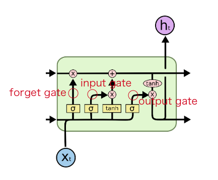
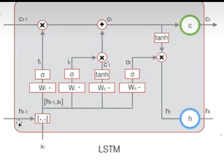
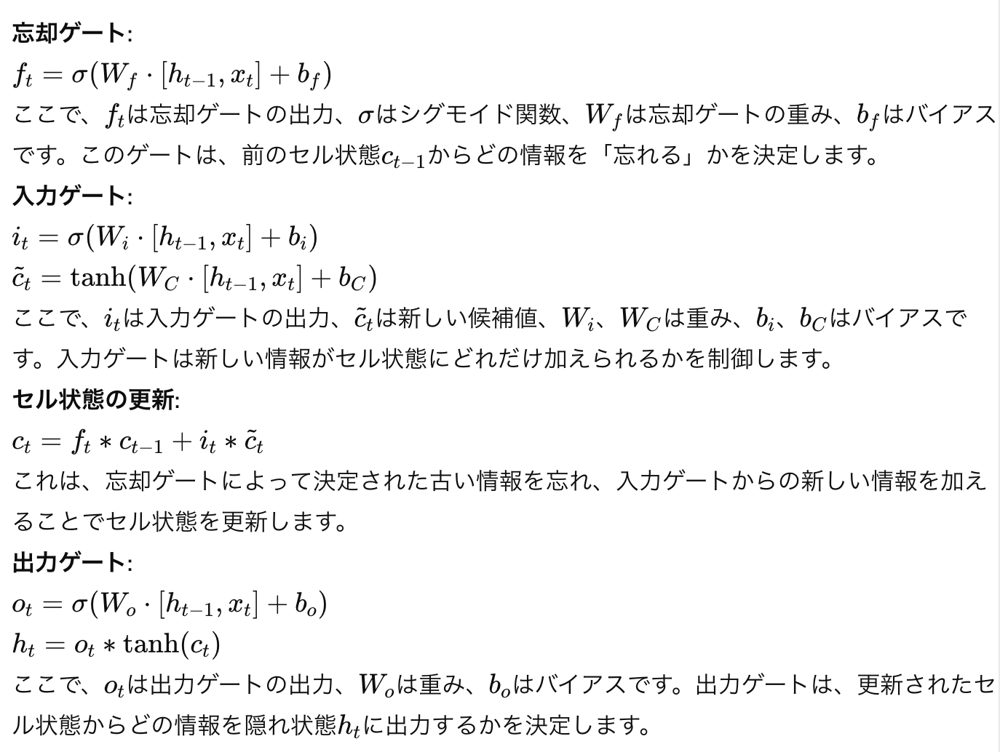
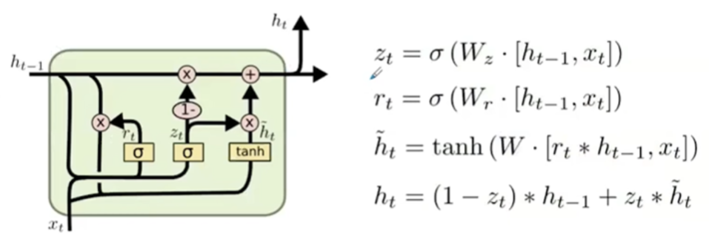
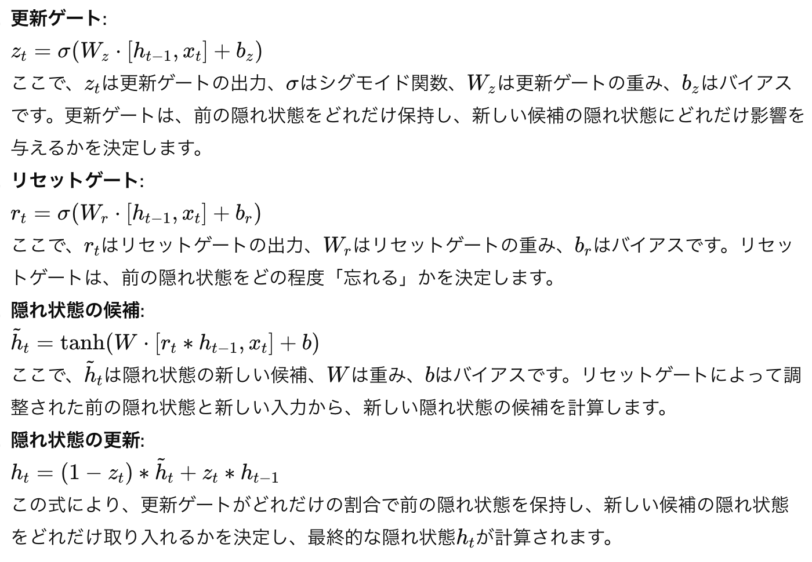

1. RNN

    1.1 RNNを設計する主な原因

        シーケンスデータの処理
        動機: 自然言語処理（NLP）、音声認識、時系列予測など、入力データが時間的な順序を持つタスクに対応するため。RNNは、これらのシーケンス内のパターンや依存関係を学習する能力があります。
        
        時間的な依存関係の把握
        動機: 過去のデータが現在の出力に重要な影響を与える場合、RNNはそのような時間的な依存関係をモデル化できます。例えば、言語モデルでは、文の意味を理解するために前の単語の文脈が必要です。
        
        可変長の入力・出力
        動機: 固定サイズの入力を扱う従来のニューラルネットワークと異なり、RNNは可変長の入力シーケンスを処理することができます。これにより、任意の長さのテキストや音声データを扱うことが可能になります。

    1.2 考慮事項

        長期依存性の問題
        
        課題: 標準的なRNNは、長期依存性の問題（勾配消失・勾配爆発）により、長いシーケンスデータでの学習が困難です。この問題を克服するために、LSTM（Long Short-Term Memory）やGRU（Gated Recurrent Unit）などの改良されたRNNが提案されています。

        パラメータのチューニング
        課題: RNNの学習率や隠れ層のユニット数などのハイパーパラメータの選択が、モデルの性能に大きく影響します。適切なハイパーパラメータを見つけるためには、多くの実験が必要になることがあります。
        
        計算コスト
        課題: RNNはシーケンスの各時点で前の時点の隠れ状態を利用するため、並列計算が難しく、特に長いシーケンスを扱う場合には計算コストが高くなりがちです。
        
        過学習の防止
        課題: RNNも他の深層学習モデルと同様に過学習（トレーニングデータに過剰に適合すること）のリスクがあります。これを防ぐために、ドロップアウトや正則

2. LSTMとGRU

    2.1 単純なRNNの欠点

    単純なRNN（基本的な再帰的ニューラルネットワーク）は、理論上は時系列データの特徴を学習する強力な能力を持っていますが、実際には「長期依存性の問題」に直面します。この問題は、シーケンスが長くなるにつれて、初期の情報がネットワークを通過する際に失われることを意味します。具体的には、勾配消失や勾配爆発の問題が生じ、モデルが長期間の依存関係を効果的に学習することが難しくなります。

    2.2 LSTM

    LSTMは、入力ゲート、忘却ゲート、出力ゲートの3つの主要なゲートを持っています。これらのゲートは、それぞれ新しい情報を隠れ状態にどの程度追加するか、隠れ状態から情報をどの程度忘れるか、隠れ状態から次の層へとどの程度の情報を出力するかを制御します。LSTMは、多くの自然言語処理や音声認識タスクにおいて、高い性能を発揮します。

    

    input gateは、セル状態を更新する役割を果たします。
    
    forget gateでは、通過させる情報と通化させない情報を決定します。
    
    output gateは、隠れユニットの値の更新方法を決定します。

    

    

    2.3 GRU

    GRUはLSTMを簡略化したバージョンであり、リセットゲートと更新ゲートの2つのゲートを使用します。これらは、新しい情報の統合方法と、過去の情報をどの程度保持するかを制御します。GRUはLSTMに比べてパラメータが少ないため、計算効率が良く、小さなデータセットでの学習が速くなる傾向があります。

    
    

