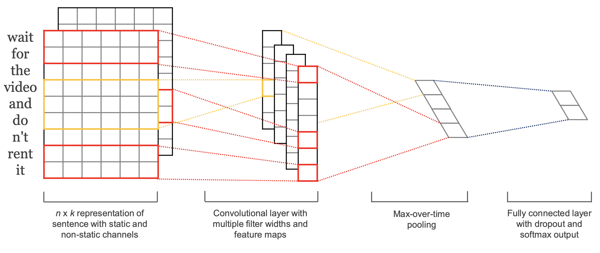

RNN

1. CNNの構造

    畳み込み層（Convolutional Layer）、活性化関数（ReLUなど）、プーリング層（Pooling Layer）、全結合層（Fully Connected Layer）から主に構成されています

    1.1 畳み込み層（Convolutional Layer）
    
        目的：入力画像から特徴を抽出する。
        
        動作：小さなフィルタ（カーネル）を入力データ上でスライドさせ、フィルタと入力データとの畳み込みを計算します。このプロセスにより、エッジやテクスチャなどの局所的特徴が抽出されます。
    
    1.2 活性化関数（Activation Function）
        
        目的：非線形性を導入する。
        
        一般的な選択：ReLU（Rectified Linear Unit）が一般的に使用されます。これは、ネットワークがより複雑な関数を学習できるようにするためです。

    1.3 プーリング層（Pooling Layer）
        
        目的：特徴マップの次元を削減し、計算コストを減らすとともに、特徴の位置変動に対する感度を下げる。
        
        動作：通常、最大プーリング（Max Pooling）または平均プーリング（Average Pooling）を使用して、特定の領域（例えば2x2ピクセル）の最大値または平均値を取り、出力サイズを減少させます。

    1.4 全結合層（Fully Connected Layer）
        
        目的：抽出された特徴を基に、最終的な分類または回帰タスクを行う。
        
        動作：ネットワークのこの部分では、以前の層からの出力を受け取り、特定のクラスに属する確率などの予測を行います。

    1.5 そのほか
        
        正規化層（Normalization Layer）：学習プロセスを安定させ、過学習を防ぐために使用されることがあります。
        
        ドロップアウト層（Dropout Layer）：過学習を防ぐために、学習中にネットワークの一部の接続をランダムに切断します。

2. Text-CNN

    2.1 論文　[リンク](https://aclanthology.org/D14-1181.pdf)

    2.2 ストラクチャー

    
    
    [source code](../../source_code/deep_learning/text-CNN.py)

3. その他

    https://qiita.com/donaldchi/items/321d96ced569d6b8389d
