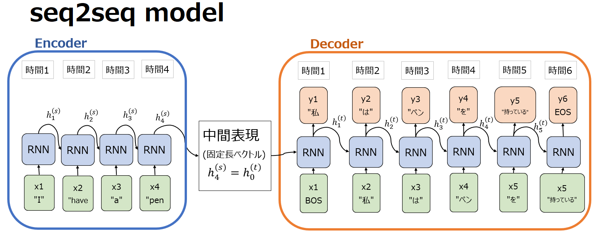

Attention Mechanism

1. Seq2Seqについて

    1.1 Seq2Seq
    Seq2Seqモデルは一連の入力を別の一連の出力に変換するために設計された深層学習のフレームワークです。基本的な構造は、エンコーダ部とデコーダ部の2つの主要なコンポーネントから構成されています。

    1.2 encoder

    エンコーダは、入力シーケンス（例えば、テキストの文章や単語の列）を受け取り、それを固定長のベクトル表現に変換します。このベクトルは、入力シーケンスの「意味」や「文脈」を捉えたもので、デコーダが出力シーケンスを生成する際のコンテキスト情報として機能します。エンコーダは通常、RNN、LSTM、GRUなどの再帰的ニューラルネットワークで構成されています。

    1.3 decoder

    デコーダは、エンコーダから受け取った固定長のベクトルをもとに、ターゲットシーケンス（例えば、翻訳後の文章や要約文）を一つずつ生成していきます。デコーダもエンコーダと同様にRNN、LSTM、GRUなどで構成されることが多く、各ステップでの出力が次のステップの入力にも用いられます。デコーダは、エンコーダからの情報とこれまでに生成した出力を基に、次の単語（またはトークン）を予測します。

    1.4 
    
    

    1.5 Seq2Seqの欠点

        Seq2Seqモデルにはいくつかの欠点があります。
        
        まず、入力シーケンスXの長さを無視しています。入力文が非常に長く、特に訓練セットの初期の文よりも長い場合、モデルの性能が急激に低下します。
        
        また、入力シーケンスXに対して区別をつけていません。入力Xを固定長でエンコードすると、文中の各単語に同じ重みを与えることになり、これはモデルの性能低下につながります。
        
        さらに、デコーダで最初の出力にエラーが発生すると、そのエラーが続くと修正されずに進行してしまいます。

    1.6 source code example

    

    1.7 その他

    https://qiita.com/soldier-tn/items/28f2f03c3058d671de12
    

2. Attention

