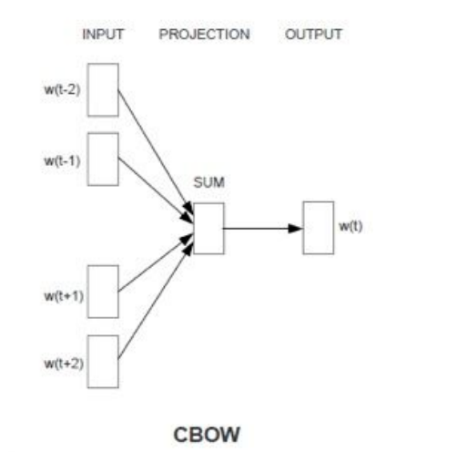
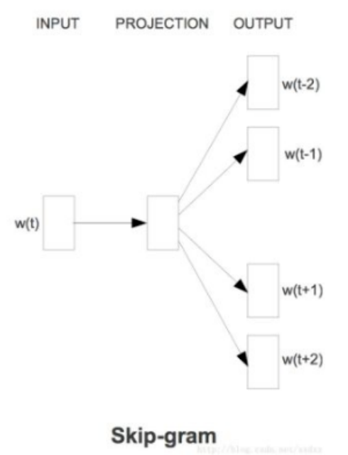

# NLP

1. Word2vec [-> Github](https://github.com/svn2github/word2vec)
    
    1.1 Word2vecは何ですか。
        
        自然言語処理（NLP）の分野で広く使用されているアルゴリズムです。Word2Vecの主な目的は、テキスト内の単語をベクトルの形で表現することにあります。このアルゴリズムは、単語が持つ意味的特徴を数値のベクトルとして捉えることができます。これにより、コンピューターがテキストをより効果的に処理し、理解することが可能になります。

        Word2Vecには主に2つのモデルがあります：CBOW（Continuous Bag of Words）と　Skip-gram
    
    1.2　Word2Vecには主に2つのモデル

        CBOW（Continuous Bag of Words）: このモデルでは、特定の単語の前後にある複数の単語（コンテキスト）を使って、その単語を予測します。

        Skip-gram: Skip-gramモデルでは、特定の単語を基にして、その周囲の単語（コンテキスト）を予測します。 

    
        

    1.2.1 CBOWの紹介

        入力: 
        CBOWモデルの入力は、ターゲット単語の周囲にあるコンテキスト単語の集合です。例えば、文「The quick brown fox jumps over the lazy dog」において、ターゲット単語が「fox」である場合、その周囲の単語（例：「quick」「brown」「jumps」「over」）が入力となります。

        出力: 
        モデルの出力は、ターゲット単語です。CBOWは、入力となるコンテキスト単語を使用して、ターゲット単語の確率分布を生成します。言い換えると、モデルは特定のコンテキストにおいて、どの単語が現れる可能性が高いかを予測します。

        CBOWの動作プロセス：
        CBOWモデルでは、まずコンテキスト単語のベクトルが平均化されます。次に、この平均化されたベクトルを使用して、ニューラルネットワークを通じてターゲット単語を予測します。モデルの訓練中には、この予測が実際のターゲット単語とどれだけ近いかに基づいて、単語のベクトル表現が調整されます。

        CBOWの利点：
        CBOWモデルは特に、大規模なコーパスにおいて、頻繁に出現する単語のベクトル表現を効果的に学習するのに適しています。また、周囲の複数の単語から情報を集約するため、文脈理解において強力です。ただし、ターゲット単語のコンテキストが非常に特定的であったり、単語が希少である場合には、Skip-gramモデルの方が適している場合があります。

    1.2.2 Skip_gramの紹介
        
        入力: 
        Skip-gramモデルの入力は、ターゲットとなる単一の単語です。たとえば、文「The quick brown fox jumps over the lazy dog」で「fox」という単語を考えた場合、この「fox」が入力単語になります。

        出力: 
        出力は、入力単語の周囲にあるコンテキスト単語の集合です。上記の例で言えば、「quick」、「brown」、「jumps」、「over」などが「fox」のコンテキストに該当します。モデルは、入力単語に基づいてこれらのコンテキスト単語の確率分布を予測します。

        Skip-gramの動作プロセス：
        Skip-gramモデルでは、ターゲット単語のベクトル表現を取得し、その単語ベクトルを使用してコンテキスト内の各単語の確率を予測します。このプロセスでは、ターゲット単語からコンテキスト単語の出現確率を最大化するように、単語のベクトル表現を調整していきます。

        Skip-gramの利点：
        Skip-gramモデルは、特に単語の出現頻度が低い場合や特定の文脈において有用です。このモデルは、ある単語が与えられたときに、その単語が出現する可能性のあるコンテキストを捉えることができます。したがって、文脈上の多様性や特異性に富む単語表現の学習に優れています。

    1.3 Word2Vecの最適化手法

    1.3.1 ハフマン木の応用

        ハフマン符号化: ハフマン木は、ハフマン符号化という手法を使用しています。これは、各単語に一意のバイナリコード（0と1の列）を割り当てる手法で、より頻繁に出現する単語にはより短いコードを、まれな単語にはより長いコードを割り当てます。

        木構造: この木構造では、頻繁に出現する単語は木の根に近い位置に、まれな単語は木の葉に近い位置に配置されます。これにより、単語の探索とトレーニングプロセスが効率化されます。

        利点：
        1. 計算量が下がる：Vー> Log2V
        2. Word2Vecのような単語埋め込みモデルにおいて、ハフマン木はトレーニングプロセスを高速化します。単語の探索と分類が効率的になるため、特に大規模な語彙を持つデータセットにおいて、計算コストと時間を削減できます。

    1.3.2 ネガティブの応用

        基本的な概念: ネガティブサンプリングは、Word2Vecモデル（特にSkip-gramモデル）において、全語彙にわたる重い計算コストを避けるために使用されます。通常のトレーニングプロセスでは、ターゲット単語のコンテキスト内で現れる単語（ポジティブな例）と、現れない単語（ネガティブな例）を区別する必要があります。

        プロセス: ネガティブサンプリングでは、コンテキスト内に現れる単語（ポジティブな例）に加えて、ランダムに選ばれた少数の単語（ネガティブな例）のみを更新対象とします。これにより、モデルは効率的に単語間の関係を学習できます。

        ネガティブサンプリングの利点：
        計算コストの削減: 全語彙に対する更新ではなく、選択された少数のネガティブな単語のみを更新することで、大幅な計算効率の向上が見込めます。

        高速なトレーニング: モデルのトレーニング時間が短縮され、大規模なデータセットでも迅速に処理できます。

        過学習の防止: ネガティブサンプリングにより、特定の単語に対するモデルの過適合を防ぐことができます。

        希少な単語の扱い: 頻繁に出現する単語だけでなく、希少な単語に対しても効果的に学習が行えます。

    1.4 ソースコードの例

        1. 原理をよりよく理解するため
        
        cbow.py -> https://github.com/oreilly-japan/deep-learning-from-scratch-2/blob/master/ch04/cbow.py

        skip_gram.py -> https://github.com/oreilly-japan/deep-learning-from-scratch-2/blob/master/ch04/skip_gram.py

        negative_sampling -> https://github.com/oreilly-japan/deep-learning-from-scratch-2/blob/master/ch04/negative_sampling_layer.py

        2. gensimを使う

        code_example_1_4_1.py

    1.5 word2vec訓練のテクニック

        1. windowsのサイズ：単語のコンテキスト（前後の単語）をどの程度考慮するか。一般的には5～10。

        2. 次元数：単語ベクトルの次元（一般的には100～300）。大きすぎると計算コストが増え、小さすぎると単語の意味を捉えられなくなります。

        3．最小単語頻度：モデルに含める単語の最小出現回数。あまりにも少ない回数で出現する単語はノイズとなる可能性があります

    

